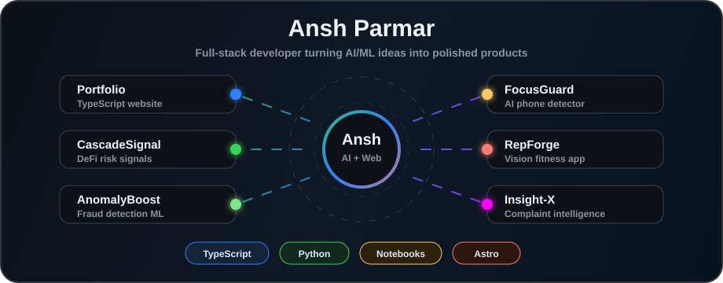

<h1 align="center">Hi, I'm Ansh Parmar</h1>

  

  Building polished software, intelligent systems, and modern developer experiences.

  <a href="https://github.com/AnshParmar123?tab=repositories">Projects</a>
  ·
  <a href="https://github.com/AnshParmar123?tab=stars">Stars</a>
  ·
  <a href="https://github.com/AnshParmar123?tab=followers">Followers</a>

 

## About Me

  I enjoy building reliable web apps, experimenting with AI systems, and designing projects that feel fast, thoughtful, and production-ready.

  I care about clean interfaces, strong engineering foundations, and projects that solve a real problem instead of just looking impressive.

 

## Contribution Snake

  <picture>
    <source media="(prefers-color-scheme: dark)" srcset="https://raw.githubusercontent.com/AnshParmar123/AnshParmar123/output/dist/github-snake-dark.svg" />
    <source media="(prefers-color-scheme: light)" srcset="https://raw.githubusercontent.com/AnshParmar123/AnshParmar123/output/dist/github-snake.svg" />
    
  </picture>

  <a href="https://raw.githubusercontent.com/AnshParmar123/AnshParmar123/output/dist/github-snake.gif">View GIF version</a>

 

## GitHub Snapshot

  

<table align="center">
  <tr>
    <td align="center" width="220">
      <strong>Projects</strong>
       
      Full-stack apps, APIs, and polished interfaces
    </td>
    <td align="center" width="220">
      <strong>AI Builder</strong>
       
      Machine learning experiments and intelligent tools
    </td>
    <td align="center" width="220">
      <strong>Open Source</strong>
       
      Learning, shipping, and improving in public
    </td>
  </tr>
</table>

  <a href="https://github.com/AnshParmar123?tab=repositories">Repositories</a>
  ·
  <a href="https://github.com/AnshParmar123?tab=stars">Starred Projects</a>
  ·
  <a href="https://github.com/AnshParmar123?tab=followers">Community</a>

